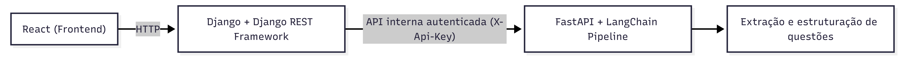
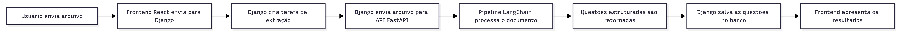
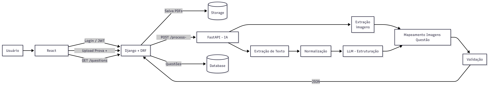

<h1 align="center">Plataforma de Estudos com IA</h1>

<div align="center">


[](#)
[](#)


</div>

## Sobre o Projeto

Plataforma web para gerenciamento e resolução de questões de provas, integrada a um pipeline de extração automática de questões baseado em IA.

O sistema permite que usuário façam upload de exames em PDF, que são processados por um pipeline externo responsável por extrair, normalizar e estruturar as questões, retornando dados organizados para serem armazenados no banco de dados e exibidos na interface do usuário.

## Arquitetura do Sistema

O projeto segue uma arquitetura full-stack distribuída, separando interface, backend e processamento de IA em camadas distintas:



### Responsabilidades de cada camada

- **Frontend (React + Vite):**
  - Interface de usuário
  - Autenticação de usuário e gerenciamento de sessão
  - Upload de arquivos
  - Visualização e interação de questões

- **Backend (Django + Django REST Framework):**
  - API REST para gerenciamento de usuários e exames
  - Segurança e autenticação via JWT
  - Persistência de dados
  - Orquestração da comunicação com o pipeline de IA

- **Pipeline de IA (FastAPI + LangChain):**
  - Processamento de arquivos PDF de prova
  - Extração e normalização de questões
  - Estruturação de questões via LLM
  - Retorno de JSON validado

## Fluxo de Funcionamento



## Autenticação e Segurança

### Autenticação de usuários

O sistema utiliza JWT para autenticação, com tokens armazenados em cookies HTTP-Only para garantir segurança contra ataques XSS. O backend valida os tokens em cada requisição protegida, garantindo que apenas usuários autenticados possam acessar recursos sensíveis.

**Fluxo de Autenticação:**

1. O usuário se registra ou faz login, enviando suas credenciais para o backend.
2. O backend valida as credenciais e, se forem corretas, gera um JWT contendo as informações do usuário.
3. O token é enviado de volta ao cliente e armazenado em um cookie HTTP-Only.
4. Em requisições subsequentes, o token é automaticamente incluído no cabeçalho da requisição, permitindo que o backend autentique o usuário e autorize o acesso aos recursos protegidos.

### Comunicação entre serviços (Django e FastAPI)

A comunicação entre o backend Django e o pipeline é restrita por API Key e CORS, garantindo que apenas o backend possa acessar os endpoints do pipeline de IA. O pipeline valida a API Key em cada requisição, rejeitando acessos não autorizados.

Exemplo de request interno:

```http
POST /process-exam
Host: pipeline-service
X-API-Key: <API_KEY>
Content-Type: multipart/form-data
```

## Estrutura do Projeto

```bash
├── backend
│   ├── apps
│   │   ├── question
│   │   │   ├── api_contract.py
│   │   │   ├── dto.py
│   │   │   └── mapper.py
│   │   └── user
│   └── project
├── dotenv_files
├── frontend
│   └── src
│       ├── actions
│       ├── components
│       ├── contexts
│       ├── models
│       │   ├── Question
│       │   └── User
│       ├── pages
│       ├── providers
│       │   ├── Question
│       │   └── User
│       ├── reducers
│       ├── routers
│       ├── services
│       └── templates
└── scripts
```

### Backend

- **Tecnologias**:
  - Django
  - Django REST Framework
  - JWT Authentication
  - Services, DTOs e Mappers pattern
- **Responsabilidades**:
  - API da aplicação
  - Persistência de dados
  - Integração com o pipeline

### Frontend

- **Tecnologias**:
  - React
  - TypeScript
  - Vite
- **Responsabilidades**:
  - Interface de usuário
  - Upload de arquivos
  - Consumo da API

### Integração com Pipeline de IA

O projeto integra-se a um pipeline externo de extração de exames, que utiliza validação estruturada com Pydantic para garantir consistência entre o output do LLM e o schema esperado pelo backend.

- **Tecnologias**:
  - FastAPI
  - LangChain
  - Pydantic
  - LLMs para parsing de questões
- **Responsabilidades**:
  - Diagnóstico do arquivo
  - Extração e normalização de questões
  - Estruturação em JSON
  - Validação com schema

---

## Fluxo Completo da Aplicação



## Documentação de Endpoints

A documentação completa dos endpoints do backend está disponível em:

- [docs/endpoints-backend.md](docs/endpoints-backend.md)

## Como Rodar o Projeto

### Pré-requisitos

- Python 3.13+
- Node.js
- [Docker Desktop](https://www.docker.com/products/docker-desktop/) instalado.
- Uma **API Key do Google Gemini** (para a funcionalidade de extração de questões).

### 1. Clonar o repositório

```bash
git clone https://github.com/luis-otavio-dias/projeto-site-questoes.git
cd projeto-site-questoes
```

### 2. Configurar Varíaveis de Ambiente

Exemplo disponível em: `dotenv_files/.env.example`.

Principais variáveis:

```env
SECRET_KEY=
DEBUG=
DATABASE_URL=


PIPELINE_API_URL=
PIPELINE_API_KEY=
```

### 3. Executar o Backend

**Executando com Docker (Recomendado)**

```bash
docker compose up --build
```

O comando acima irá:

1. Construir a imagem do Backend.
2. Instalar as dependências do sistema.
3. Rodar as migrações do banco de dados.
4. Coletar arquivos estáticos.
5. Iniciar o servidor em `http://localhost:8000`

Para criar um superuser:

```bash
docker compose up -d
docker compose exec backend python manage.py createsuperuser
```

**Executando localmente (sem Docker)**

````bash
cd backend
uv sync
uv run manage.py migrate
uv run manage.py runserver
```

### 4. Executando o Frontend

```bash
cd frontend
npm install
npm run dev
````

## Licença

Este projeto está sob a licença MIT. Veja o arquivo [LICENSE](LICENSE) para mais detalhes.
